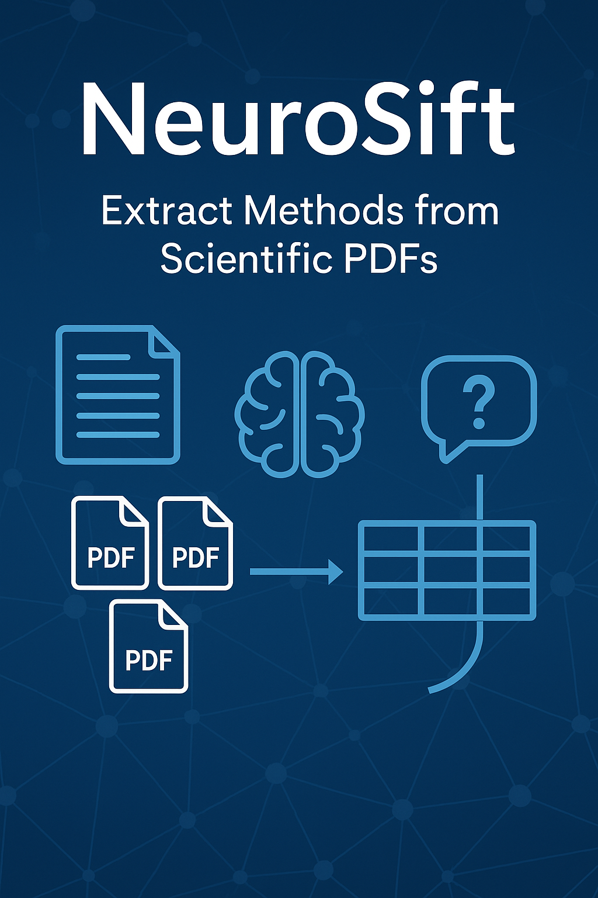

# NeuroSift: An AI Agent for extracting EEG preprocessing pipelines from scientific literature

## Repository Link

https://github.com/vaishalivinod/NeuroSift_LLMCourse_OC

## Description
NeuroSift is an intelligent question-answering tool designed to extract methodological insights from scientific PDF articles, especially in the neuroscience and biomedical research domain. It allows researchers to upload up to 10 articles at once and ask one or more custom questions related to the study methods. NeuroSift uses a language model (FLAN-T5) to read the PDFs and answer questions in real-time.
## Key Features

- Upload up to 10 scientific PDFs at once
- Ask multiple customizable questions
- Uses Google FLAN-T5 for natural language understanding
- Focused on extracting methods from neuroscience/biomedical articles
- Answers presented in a clean, searchable table
- Built using Streamlit and HuggingFace Transformers

### Task Type

Question Answering

## Documentation

1. **[Literature Review](0_LiteratureReview/README.md)**
2. **[Dataset Characteristics](1_DatasetCharacteristics/exploratory_data_analysis.ipynb)**
3. **[Baseline Model](2_BaselineModel/baseline_model.ipynb)**
4. **[Model Definition and Evaluation](3_Model/model_definition_evaluation)**
5. **[Presentation](4_Presentation/README.md)**

## Cover Image

